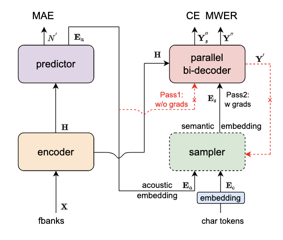

---
tasks:
- auto-speech-recognition
domain:
- audio
model-type:
- Non-autoregressive
frameworks:
- pytorch
backbone:
- transformer/conformer
metrics:
- CER
license: Apache License 2.0
language: 
- cn
tags:
- FunASR
- Paraformer
- Alibaba
- INTERSPEECH 2022
datasets:
  train:
  - 60,000 hour industrial Mandarin task
  test:
  - AISHELL-1 dev/test
  - AISHELL-2 dev_android/dev_ios/dev_mic/test_android/test_ios/test_mic
  - WentSpeech dev/test_meeting/test_net
  - SpeechIO TIOBE
  - 60,000 hour industrial Mandarin task
indexing:
   results:
   - task:
       name: Automatic Speech Recognition
     dataset:
       name: 60,000 hour industrial Mandarin task
       type: audio    # optional
       args: 16k sampling rate, 8404 characters  # optional
     metrics:
       - type: CER
         value: 8.53%  # float
         description: greedy search, withou lm, avg.
         args: default
       - type: RTF
         value: 0.0251  # float
         description: GPU inference on V100
         args: batch_size=1
widgets:
  - task: auto-speech-recognition
    inputs:
      - type: audio
        name: input
        title: 音频
    examples:
      - name: 1
        title: 示例1
        inputs:
          - name: input
            data: https://isv-data.oss-cn-hangzhou.aliyuncs.com/ics/MaaS/ASR/test_audio/asr_example_zh.wav
    inferencespec:
      cpu: 8 #CPU数量
      memory: 4096
finetune-support: True
---


# Paraformer-large模型介绍

## Highlights
- 热词版本：[Paraformer-large热词版模型](https://www.modelscope.cn/models/damo/speech_paraformer-large-contextual_asr_nat-zh-cn-16k-common-vocab8404/summary)支持热词定制功能，基于提供的热词列表进行激励增强，提升热词的召回率和准确率。
- 长音频版本：[Paraformer-large长音频模型](https://www.modelscope.cn/models/damo/speech_paraformer-large-vad-punc_asr_nat-zh-cn-16k-common-vocab8404-pytorch/summary)，集成VAD、ASR、标点与时间戳功能，可直接对时长为数小时音频进行识别，并输出带标点文字与时间戳。

## <strong>[FunASR开源项目介绍](https://github.com/alibaba-damo-academy/FunASR)</strong>
<strong>[FunASR](https://github.com/alibaba-damo-academy/FunASR)</strong>希望在语音识别的学术研究和工业应用之间架起一座桥梁。通过发布工业级语音识别模型的训练和微调，研究人员和开发人员可以更方便地进行语音识别模型的研究和生产，并推动语音识别生态的发展。让语音识别更有趣！

[**github仓库**](https://github.com/alibaba-damo-academy/FunASR)
| [**最新动态**](https://github.com/alibaba-damo-academy/FunASR#whats-new) 
| [**环境安装**](https://github.com/alibaba-damo-academy/FunASR#installation)
| [**服务部署**](https://www.funasr.com)
| [**模型库**](https://github.com/alibaba-damo-academy/FunASR/tree/main/model_zoo)
| [**联系我们**](https://github.com/alibaba-damo-academy/FunASR#contact)


## 模型原理介绍

Paraformer是达摩院语音团队提出的一种高效的非自回归端到端语音识别框架。本项目为Paraformer中文通用语音识别模型，采用工业级数万小时的标注音频进行模型训练，保证了模型的通用识别效果。模型可以被应用于语音输入法、语音导航、智能会议纪要等场景。

<p align="center">



Paraformer模型结构如上图所示，由 Encoder、Predictor、Sampler、Decoder 与 Loss function 五部分组成。Encoder可以采用不同的网络结构，例如self-attention，conformer，SAN-M等。Predictor 为两层FFN，预测目标文字个数以及抽取目标文字对应的声学向量。Sampler 为无可学习参数模块，依据输入的声学向量和目标向量，生产含有语义的特征向量。Decoder 结构与自回归模型类似，为双向建模（自回归为单向建模）。Loss function 部分，除了交叉熵（CE）与 MWER 区分性优化目标，还包括了 Predictor 优化目标 MAE。


其核心点主要有：  
- Predictor 模块：基于 Continuous integrate-and-fire (CIF) 的 预测器 (Predictor) 来抽取目标文字对应的声学特征向量，可以更加准确的预测语音中目标文字个数。  
- Sampler：通过采样，将声学特征向量与目标文字向量变换成含有语义信息的特征向量，配合双向的 Decoder 来增强模型对于上下文的建模能力。  
- 基于负样本采样的 MWER 训练准则。  

更详细的细节见：
- 论文： [Paraformer: Fast and Accurate Parallel Transformer for Non-autoregressive End-to-End Speech Recognition](https://arxiv.org/abs/2206.08317)
- 论文解读：[Paraformer: 高识别率、高计算效率的单轮非自回归端到端语音识别模型](https://mp.weixin.qq.com/s/xQ87isj5_wxWiQs4qUXtVw)


## 基于ModelScope进行推理

- 推理支持音频格式如下：
  - wav文件路径，例如：data/test/audios/asr_example.wav
  - pcm文件路径，例如：data/test/audios/asr_example.pcm
  - wav文件url，例如：https://isv-data.oss-cn-hangzhou.aliyuncs.com/ics/MaaS/ASR/test_audio/asr_example_zh.wav
  - wav二进制数据，格式bytes，例如：用户直接从文件里读出bytes数据或者是麦克风录出bytes数据。
  - 已解析的audio音频，例如：audio, rate = soundfile.read("asr_example_zh.wav")，类型为numpy.ndarray或者torch.Tensor。
  - wav.scp文件，需符合如下要求：

```sh
cat wav.scp
asr_example1  data/test/audios/asr_example1.wav
asr_example2  data/test/audios/asr_example2.wav
...
```

- 若输入格式wav文件url，api调用方式可参考如下范例：

```python
from modelscope.pipelines import pipeline
from modelscope.utils.constant import Tasks

inference_pipeline = pipeline(
    task=Tasks.auto_speech_recognition,
    model='iic/speech_paraformer-large_asr_nat-zh-cn-16k-common-vocab8404-pytorch', model_revision="v2.0.4")

rec_result = inference_pipeline('https://isv-data.oss-cn-hangzhou.aliyuncs.com/ics/MaaS/ASR/test_audio/asr_example_zh.wav')
print(rec_result)
```

- 输入音频为pcm格式，调用api时需要传入音频采样率参数audio_fs，例如：

```python
rec_result = inference_pipeline('https://isv-data.oss-cn-hangzhou.aliyuncs.com/ics/MaaS/ASR/test_audio/asr_example_zh.pcm', audio_fs=16000)
```

- 输入音频为wav格式，api调用方式可参考如下范例:

```python
rec_result = inference_pipeline('asr_example_zh.wav')
```

- 若输入格式为文件wav.scp(注：文件名需要以.scp结尾)，可添加 output_dir 参数将识别结果写入文件中，api调用方式可参考如下范例:

```python
inference_pipeline("wav.scp", output_dir='./output_dir')
```
识别结果输出路径结构如下：

```sh
tree output_dir/
output_dir/
└── 1best_recog
    ├── score
    └── text

1 directory, 3 files
```
score：识别路径得分

text：语音识别结果文件


- 若输入音频为已解析的audio音频，api调用方式可参考如下范例：

```python
import soundfile

waveform, sample_rate = soundfile.read("asr_example_zh.wav")
rec_result = inference_pipeline(waveform)
```

- ASR、VAD、PUNC模型自由组合

可根据使用需求对VAD和PUNC标点模型进行自由组合，使用方式如下：
```python
inference_pipeline = pipeline(
    task=Tasks.auto_speech_recognition,
    model='iic/speech_paraformer-large_asr_nat-zh-cn-16k-common-vocab8404-pytorch', model_revision="v2.0.4",
    vad_model='iic/speech_fsmn_vad_zh-cn-16k-common-pytorch', vad_model_revision="v2.0.4",
    punc_model='iic/punc_ct-transformer_zh-cn-common-vocab272727-pytorch', punc_model_revision="v2.0.3",
    # spk_model="iic/speech_campplus_sv_zh-cn_16k-common",
    # spk_model_revision="v2.0.2",
)
```
若不使用PUNC模型，可配置punc_model=""，或不传入punc_model参数，如需加入LM模型，可增加配置lm_model='damo/speech_transformer_lm_zh-cn-common-vocab8404-pytorch'，并设置lm_weight和beam_size参数。

## 基于FunASR进行推理

下面为快速上手教程，测试音频（[中文](https://isv-data.oss-cn-hangzhou.aliyuncs.com/ics/MaaS/ASR/test_audio/vad_example.wav)，[英文](https://isv-data.oss-cn-hangzhou.aliyuncs.com/ics/MaaS/ASR/test_audio/asr_example_en.wav)）

### 可执行命令行
在命令行终端执行：

```shell
funasr +model=paraformer-zh +vad_model="fsmn-vad" +punc_model="ct-punc" +input=vad_example.wav
```

注：支持单条音频文件识别，也支持文件列表，列表为kaldi风格wav.scp：`wav_id   wav_path`

### python示例
#### 非实时语音识别
```python
from funasr import AutoModel
# paraformer-zh is a multi-functional asr model
# use vad, punc, spk or not as you need
model = AutoModel(model="paraformer-zh", model_revision="v2.0.4",
                  vad_model="fsmn-vad", vad_model_revision="v2.0.4",
                  punc_model="ct-punc-c", punc_model_revision="v2.0.4",
                  # spk_model="cam++", spk_model_revision="v2.0.2",
                  )
res = model.generate(input=f"{model.model_path}/example/asr_example.wav", 
            batch_size_s=300, 
            hotword='魔搭')
print(res)
```
注：`model_hub`：表示模型仓库，`ms`为选择modelscope下载，`hf`为选择huggingface下载。

#### 实时语音识别

```python
from funasr import AutoModel

chunk_size = [0, 10, 5] #[0, 10, 5] 600ms, [0, 8, 4] 480ms
encoder_chunk_look_back = 4 #number of chunks to lookback for encoder self-attention
decoder_chunk_look_back = 1 #number of encoder chunks to lookback for decoder cross-attention

model = AutoModel(model="paraformer-zh-streaming", model_revision="v2.0.4")

import soundfile
import os

wav_file = os.path.join(model.model_path, "example/asr_example.wav")
speech, sample_rate = soundfile.read(wav_file)
chunk_stride = chunk_size[1] * 960 # 600ms

cache = {}
total_chunk_num = int(len((speech)-1)/chunk_stride+1)
for i in range(total_chunk_num):
    speech_chunk = speech[i*chunk_stride:(i+1)*chunk_stride]
    is_final = i == total_chunk_num - 1
    res = model.generate(input=speech_chunk, cache=cache, is_final=is_final, chunk_size=chunk_size, encoder_chunk_look_back=encoder_chunk_look_back, decoder_chunk_look_back=decoder_chunk_look_back)
    print(res)
```

注：`chunk_size`为流式延时配置，`[0,10,5]`表示上屏实时出字粒度为`10*60=600ms`，未来信息为`5*60=300ms`。每次推理输入为`600ms`（采样点数为`16000*0.6=960`），输出为对应文字，最后一个语音片段输入需要设置`is_final=True`来强制输出最后一个字。

#### 语音端点检测（非实时）
```python
from funasr import AutoModel

model = AutoModel(model="fsmn-vad", model_revision="v2.0.4")

wav_file = f"{model.model_path}/example/asr_example.wav"
res = model.generate(input=wav_file)
print(res)
```

#### 语音端点检测（实时）
```python
from funasr import AutoModel

chunk_size = 200 # ms
model = AutoModel(model="fsmn-vad", model_revision="v2.0.4")

import soundfile

wav_file = f"{model.model_path}/example/vad_example.wav"
speech, sample_rate = soundfile.read(wav_file)
chunk_stride = int(chunk_size * sample_rate / 1000)

cache = {}
total_chunk_num = int(len((speech)-1)/chunk_stride+1)
for i in range(total_chunk_num):
    speech_chunk = speech[i*chunk_stride:(i+1)*chunk_stride]
    is_final = i == total_chunk_num - 1
    res = model.generate(input=speech_chunk, cache=cache, is_final=is_final, chunk_size=chunk_size)
    if len(res[0]["value"]):
        print(res)
```

#### 标点恢复
```python
from funasr import AutoModel

model = AutoModel(model="ct-punc", model_revision="v2.0.4")

res = model.generate(input="那今天的会就到这里吧 happy new year 明年见")
print(res)
```

#### 时间戳预测
```python
from funasr import AutoModel

model = AutoModel(model="fa-zh", model_revision="v2.0.4")

wav_file = f"{model.model_path}/example/asr_example.wav"
text_file = f"{model.model_path}/example/text.txt"
res = model.generate(input=(wav_file, text_file), data_type=("sound", "text"))
print(res)
```

更多详细用法（[示例](https://github.com/alibaba-damo-academy/FunASR/tree/main/examples/industrial_data_pretraining)）


## 微调

详细用法（[示例](https://github.com/alibaba-damo-academy/FunASR/tree/main/examples/industrial_data_pretraining)）


## Benchmark
  结合大数据、大模型优化的Paraformer在一序列语音识别的benchmark上获得当前SOTA的效果，以下展示学术数据集AISHELL-1、AISHELL-2、WenetSpeech，公开评测项目SpeechIO TIOBE白盒测试场景的效果。在学术界常用的中文语音识别评测任务中，其表现远远超于目前公开发表论文中的结果，远好于单独封闭数据集上的模型。

### AISHELL-1

| AISHELL-1 test                                   | w/o LM                                | w/ LM                                 |
|:------------------------------------------------:|:-------------------------------------:|:-------------------------------------:|
| <div style="width: 150pt">Espnet</div>           | <div style="width: 150pt">4.90</div>  | <div style="width: 150pt">4.70</div>  | 
| <div style="width: 150pt">Wenet</div>            | <div style="width: 150pt">4.61</div>  | <div style="width: 150pt">4.36</div>  | 
| <div style="width: 150pt">K2</div>               | <div style="width: 150pt">-</div>     | <div style="width: 150pt">4.26</div>  | 
| <div style="width: 150pt">Blockformer</div>      | <div style="width: 150pt">4.29</div>  | <div style="width: 150pt">4.05</div>  |
| <div style="width: 150pt">Paraformer-large</div> | <div style="width: 150pt">1.95</div>  | <div style="width: 150pt">1.68</div>  | 

### AISHELL-2

|           | dev_ios| test_android| test_ios|test_mic|
|:-------------------------------------------------:|:-------------------------------------:|:-------------------------------------:|:------------------------------------:|:------------------------------------:|
| <div style="width: 150pt">Espnet</div>            | <div style="width: 70pt">5.40</div>  |<div style="width: 70pt">6.10</div>  |<div style="width: 70pt">5.70</div>  |<div style="width: 70pt">6.10</div>  |
| <div style="width: 150pt">WeNet</div>             | <div style="width: 70pt">-</div>     |<div style="width: 70pt">-</div>     |<div style="width: 70pt">5.39</div>  |<div style="width: 70pt">-</div>    |
| <div style="width: 150pt">Paraformer-large</div>  | <div style="width: 70pt">2.80</div>  |<div style="width: 70pt">3.13</div>  |<div style="width: 70pt">2.85</div>  |<div style="width: 70pt">3.06</div>  |


### Wenetspeech

|           | dev| test_meeting| test_net|
|:-------------------------------------------------:|:-------------------------------------:|:-------------------------------------:|:------------------------------------:|
| <div style="width: 150pt">Espnet</div>            | <div style="width: 100pt">9.70</div>  |<div style="width: 100pt">15.90</div>  |<div style="width: 100pt">8.80</div>  |
| <div style="width: 150pt">WeNet</div>             | <div style="width: 100pt">8.60</div>  |<div style="width: 100pt">17.34</div>  |<div style="width: 100pt">9.26</div>  |
| <div style="width: 150pt">K2</div>                | <div style="width: 100pt">7.76</div>  |<div style="width: 100pt">13.41</div>  |<div style="width: 100pt">8.71</div>  |
| <div style="width: 150pt">Paraformer-large</div>  | <div style="width: 100pt">3.57</div>  |<div style="width: 100pt">6.97</div>   |<div style="width: 100pt">6.74</div>  |

### SpeechIO TIOBE

Paraformer-large模型结合Transformer-LM模型做shallow fusion，在公开评测项目SpeechIO TIOBE白盒测试场景上获得当前SOTA的效果，目前[Transformer-LM模型](https://modelscope.cn/models/damo/speech_transformer_lm_zh-cn-common-vocab8404-pytorch/summary)已在ModelScope上开源，以下展示SpeechIO TIOBE白盒测试场景without LM、with Transformer-LM的效果：

- Decode config w/o LM: 
  - Decode without LM
  - Beam size: 1
- Decode config w/ LM:
  - Decode with [Transformer-LM](https://modelscope.cn/models/damo/speech_transformer_lm_zh-cn-common-vocab8404-pytorch/summary)
  - Beam size: 10
  - LM weight: 0.15

| testset | w/o LM | w/ LM |
|:------------------:|:----:|:----:|
|<div style="width: 200pt">SPEECHIO_ASR_ZH00001</div>| <div style="width: 150pt">0.49</div> | <div style="width: 150pt">0.35</div> |
|<div style="width: 200pt">SPEECHIO_ASR_ZH00002</div>| <div style="width: 150pt">3.23</div> | <div style="width: 150pt">2.86</div> |
|<div style="width: 200pt">SPEECHIO_ASR_ZH00003</div>| <div style="width: 150pt">1.13</div> | <div style="width: 150pt">0.80</div> |
|<div style="width: 200pt">SPEECHIO_ASR_ZH00004</div>| <div style="width: 150pt">1.33</div> | <div style="width: 150pt">1.10</div> |
|<div style="width: 200pt">SPEECHIO_ASR_ZH00005</div>| <div style="width: 150pt">1.41</div> | <div style="width: 150pt">1.18</div> |
|<div style="width: 200pt">SPEECHIO_ASR_ZH00006</div>| <div style="width: 150pt">5.25</div> | <div style="width: 150pt">4.85</div> |
|<div style="width: 200pt">SPEECHIO_ASR_ZH00007</div>| <div style="width: 150pt">5.51</div> | <div style="width: 150pt">4.97</div> |
|<div style="width: 200pt">SPEECHIO_ASR_ZH00008</div>| <div style="width: 150pt">3.69</div> | <div style="width: 150pt">3.18</div> |
|<div style="width: 200pt">SPEECHIO_ASR_ZH00009</div>| <div style="width: 150pt">3.02</div> | <div style="width: 150pt">2.78</div> |
|<div style="width: 200pt">SPEECHIO_ASR_ZH000010</div>| <div style="width: 150pt">3.35</div> | <div style="width: 150pt">2.99</div> |
|<div style="width: 200pt">SPEECHIO_ASR_ZH000011</div>| <div style="width: 150pt">1.54</div> | <div style="width: 150pt">1.25</div> |
|<div style="width: 200pt">SPEECHIO_ASR_ZH000012</div>| <div style="width: 150pt">2.06</div> | <div style="width: 150pt">1.68</div> |
|<div style="width: 200pt">SPEECHIO_ASR_ZH000013</div>| <div style="width: 150pt">2.57</div> | <div style="width: 150pt">2.25</div> |
|<div style="width: 200pt">SPEECHIO_ASR_ZH000014</div>| <div style="width: 150pt">3.86</div> | <div style="width: 150pt">3.08</div> |
|<div style="width: 200pt">SPEECHIO_ASR_ZH000015</div>| <div style="width: 150pt">3.34</div> | <div style="width: 150pt">2.67</div> |


## 使用方式以及适用范围

运行范围
- 支持Linux-x86_64、Mac和Windows运行。

使用方式
- 直接推理：可以直接对输入音频进行解码，输出目标文字。
- 微调：加载训练好的模型，采用私有或者开源数据进行模型训练。

使用范围与目标场景
- 适合与离线语音识别场景，如录音文件转写，配合GPU推理效果更加，推荐输入语音时长在20s以下，若想解码长音频，推荐使用[Paraformer-large长音频模型](https://www.modelscope.cn/models/damo/speech_paraformer-large-vad-punc_asr_nat-zh-cn-16k-common-vocab8404-pytorch/summary)，集成VAD、ASR、标点与时间戳功能，可直接对时长为数小时音频进行识别，并输出带标点文字与时间戳。


## 模型局限性以及可能的偏差

考虑到特征提取流程和工具以及训练工具差异，会对CER的数据带来一定的差异（<0.1%），推理GPU环境差异导致的RTF数值差异。


## 相关论文以及引用信息

```BibTeX
@inproceedings{gao2022paraformer,
  title={Paraformer: Fast and Accurate Parallel Transformer for Non-autoregressive End-to-End Speech Recognition},
  author={Gao, Zhifu and Zhang, Shiliang and McLoughlin, Ian and Yan, Zhijie},
  booktitle={INTERSPEECH},
  year={2022}
}
```
